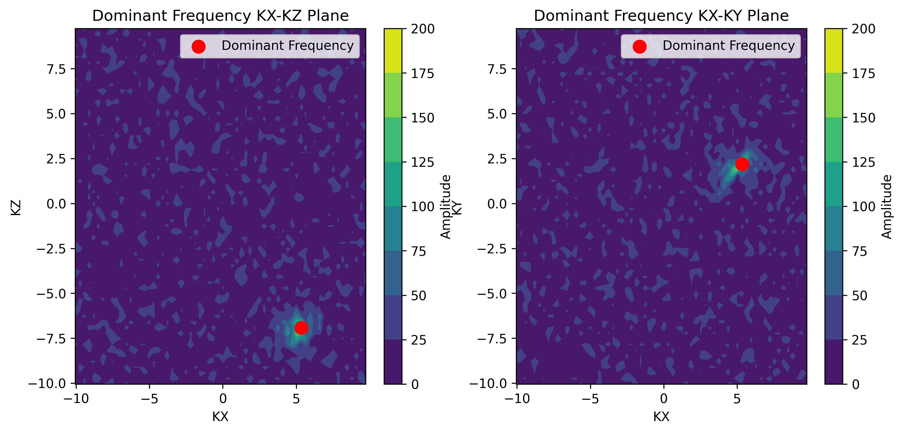
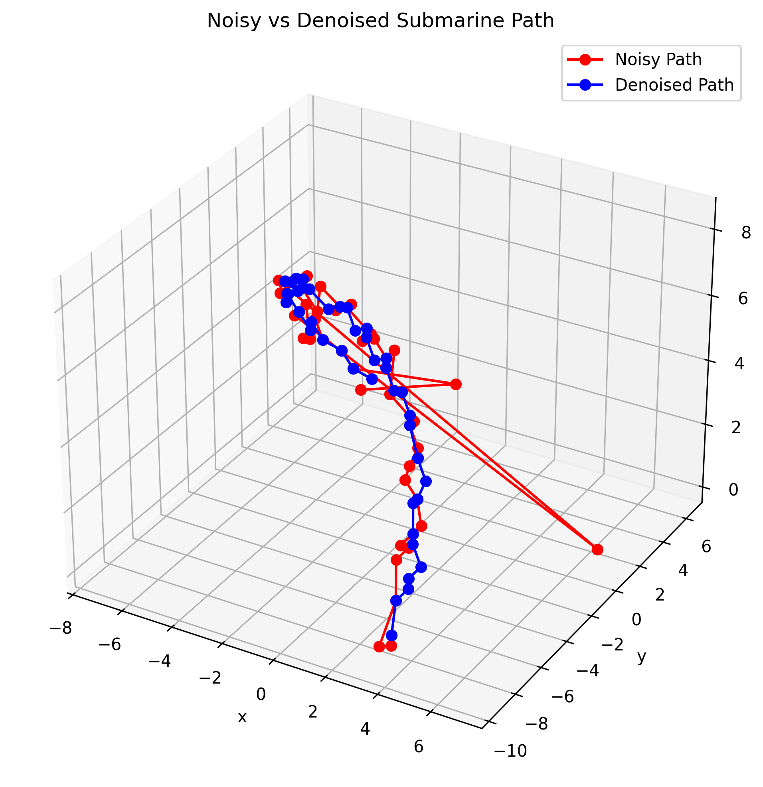
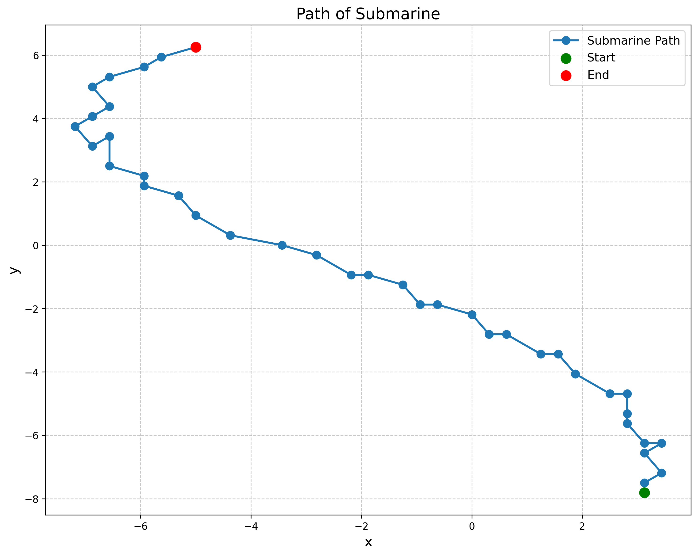

# Submarine Location Detection using Fourier Transforms

This project focuses on locating a submarine by analyzing its movement data using Fourier transforms and filtering techniques. The data consists of measurements collected from a submarine's path, which are used to estimate its position in 3D space. The methodology includes Fourier analysis to identify dominant frequencies and spatial filtering to denoise the data.

## Data

The data used in this project is stored in the `subdata.npy` file, which contains 3D measurements of the submarine's path. Each data point represents a measurement at a specific time step.

## Methodology

### Fourier Transform Averaging

The first step in the process is to compute the Fourier transforms of the data. Averages of these Fourier transforms are calculated to identify the dominant frequency of the submarine's movement in the 3D space.

1. **Averaging Fourier Transforms:** The Fourier transforms of all the signals are averaged to identify the dominant frequency of movement.
2. **Visualization:** The dominant frequency is plotted in the `KX-KZ` and `KX-KY` planes to visualize the peak in the Fourier space.

### Filtering

To isolate the submarine's actual path from noise, a spatial filter is applied. The filter focuses on the identified dominant frequency, allowing for a clearer representation of the submarine's movement.

1. **Filtering:** A Gaussian filter is applied to the Fourier-transformed data to suppress noise and retain the signal that matches the dominant frequency.
2. **Path Comparison:** The noisy and filtered submarine paths are compared in 3D space, demonstrating the effectiveness of the filter.

### Submarine Path Plotting

The filtered submarine path is plotted in 2D and 3D to visualize the journey. The path is plotted with markers indicating the start and end points for better clarity.

### Iso-surface Plotting (Optional)

Iso-surfaces are generated for selected measurements to provide an additional 3D perspective of the submarine's path. This is done using `plotly` for interactive 3D visualizations.

## Results

- The dominant frequency is identified, and its spatial representation helps in locating the submarine in the 3D domain.
- The comparison between noisy and denoised paths shows the effectiveness of Fourier-based filtering.
- The final path visualization provides a clear view of the submarine's journey.

## Example Outputs

### Dominant Frequency Plots

### Denoised vs Noisy Path

### Submarine Path in XY Coordinates

